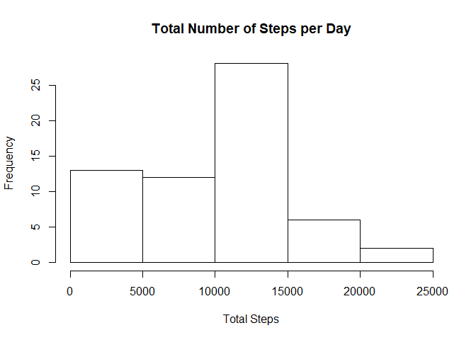
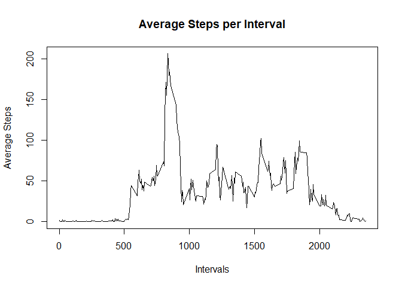
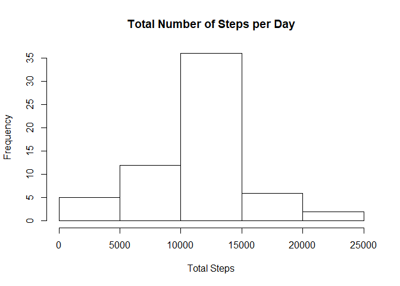
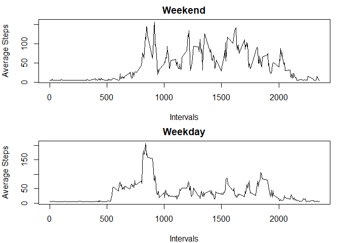

## Loading and preprocessing the data
We load the data and then transform it into the proper date format.  

```r
data <- read.csv("C:/Users/stefa/OneDrive/Desktop/Data Science/Reproducible Research/Course Project 1/activity.csv")
data[,2] <- as.Date(data$date)
```


## What is mean total number of steps taken per day?
First we calculate the total number of steps taken per day and make a histogram.  

```r
steps <- with(data, tapply(steps, date, sum, na.rm=TRUE))
hist(steps, xlab="Total Steps", ylab="Frequency", main="Total Number of Steps per Day")
```

<!-- -->

Then we calculate the mean and the median of the total number of steps taken per day.

```r
print(mean_steps <- mean(steps))
```

```
## [1] 9354.23
```

```r
print(median_steps <- median(steps))
```

```
## [1] 10395
```

So the mean and median total number of steps taken per day is 9354.23 and 10395 respectively.

## What is the average daily activity pattern?
First we make a time series plot of the 5-minute interval and the average number of steps taken, averaged across all days.  

```r
avg_steps <- with(data, tapply(steps, interval, mean, na.rm=TRUE))
intervals <- unique(data$interval)
new <- data.frame(cbind(avg_steps, intervals))
plot(new$intervals, new$avg_steps, type="l", xlab="Intervals", ylab="Average Steps", main="Average Steps per Interval")
```

<!-- -->

Next, we determine which 5-minute interval, on average across all the days in the dataset, contains the maximum number of steps.

```r
index <- which.max(new$avg_steps)
max <- new[index,2]
print(max)
```

```
## [1] 835
```

So the 5-minute interval with the maximum number of steps is 835.

## Imputing missing values
First we will calculate and report the total number of missing values in the dataset.  

```r
sum(is.na(data$steps))
```

```
## [1] 2304
```

We will use the average of average steps per day across all dates in the data set and create a new data set but the NAs replaced with that value.

```r
index <- which(is.na(data$steps))
length <- length(index)
steps_avg <- with(data, tapply(steps, date, mean, na.rm=TRUE))
na <- mean(steps_avg, na.rm=TRUE)
for (i in 1:length) {
  data[index[i],1] <- na
}
```

Now we will make a histogram of the total number of steps taken each day and calculate and report the mean and median total number of steps taken per day.  

```r
steps2 <- with(data, tapply(steps, date, sum, na.rm=TRUE))
hist(steps2, xlab="Total Steps", ylab="Frequency", main="Total Number of Steps per Day")
```

<!-- -->

```r
print(mean_steps2 <- mean(steps2))
```

```
## [1] 10766.19
```

```r
print(median_steps2 <- median(steps2))
```

```
## [1] 10766.19
```

The impact of imputing missing data on the estimates of the total daily number of steps was that the mean and median became equal.


## Are there differences in activity patterns between weekdays and weekends?

```r
library(dplyr)
```

```
## 
## Attaching package: 'dplyr'
```

```
## The following objects are masked from 'package:stats':
## 
##     filter, lag
```

```
## The following objects are masked from 'package:base':
## 
##     intersect, setdiff, setequal, union
```

We need to create a new factor variable in the dataset that shows whether a given date is a weekday or weekend day.  

```r
data2 <- mutate(data, day = ifelse(weekdays(data$date) == "Saturday" | weekdays(data$date) == "Sunday", "weekend", "weekday"))
data2$day <- as.factor(data2$day)
```

Now we make a panel plot containing a time series plot of the 5-minute interval and the average number of steps taken, averaged across all weekday days or weekend days.  

```r
data_weekend <- subset(data2, as.character(data2$day) == "weekend")
data_weekday <- subset(data2, as.character(data2$day) == "weekday")
steps_weekend <- with(data_weekend, tapply(steps, interval, mean, na.rm=TRUE))
steps_weekday <- with(data_weekday, tapply(steps, interval, mean, na.rm=TRUE))
interval_weekend <- unique(data_weekend$interval)
interval_weekday <- unique(data_weekday$interval)
new_weekend <- data.frame(cbind(steps_weekend, interval_weekend))
new_weekday <- data.frame(cbind(steps_weekday, interval_weekday))
par(mfrow=c(2,1), mar=c(4,4,2,1))
plot(new_weekend$interval_weekend, new_weekend$steps_weekend, type="l", xlab="Intervals", ylab="Average Steps", main="Weekend")
plot(new_weekday$interval_weekday, new_weekday$steps_weekday, type="l", xlab="Intervals", ylab="Average Steps", main="Weekday")
```

<!-- -->

From the plot, weekend days generally have higher average steps than weekdays.
